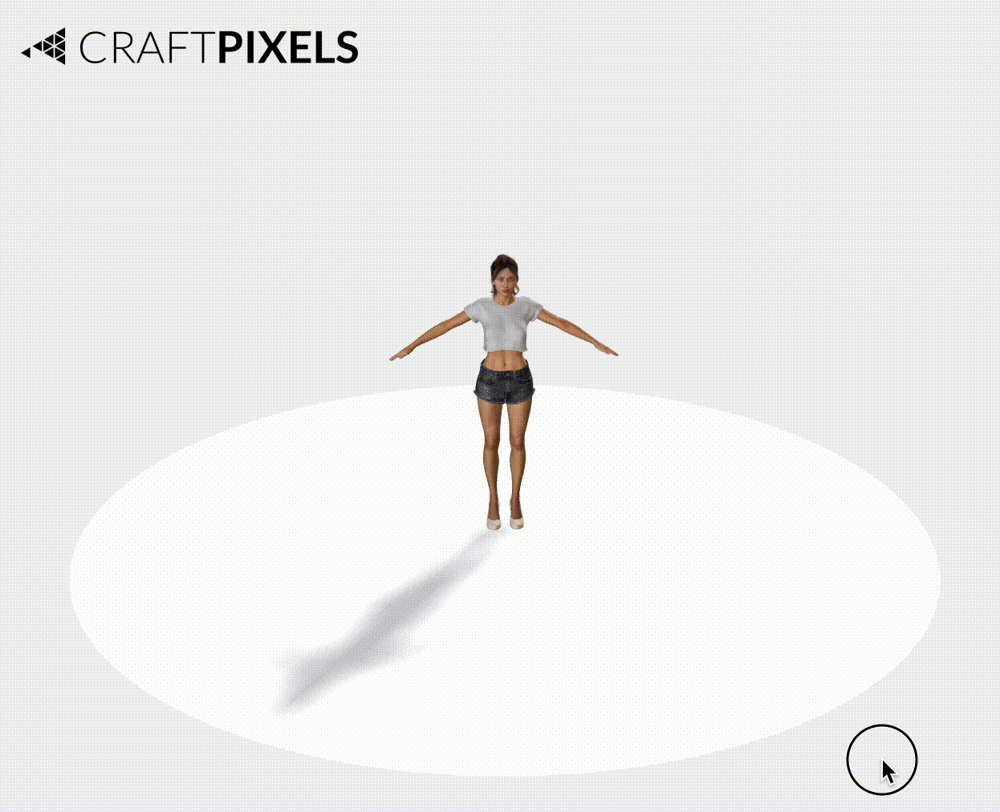
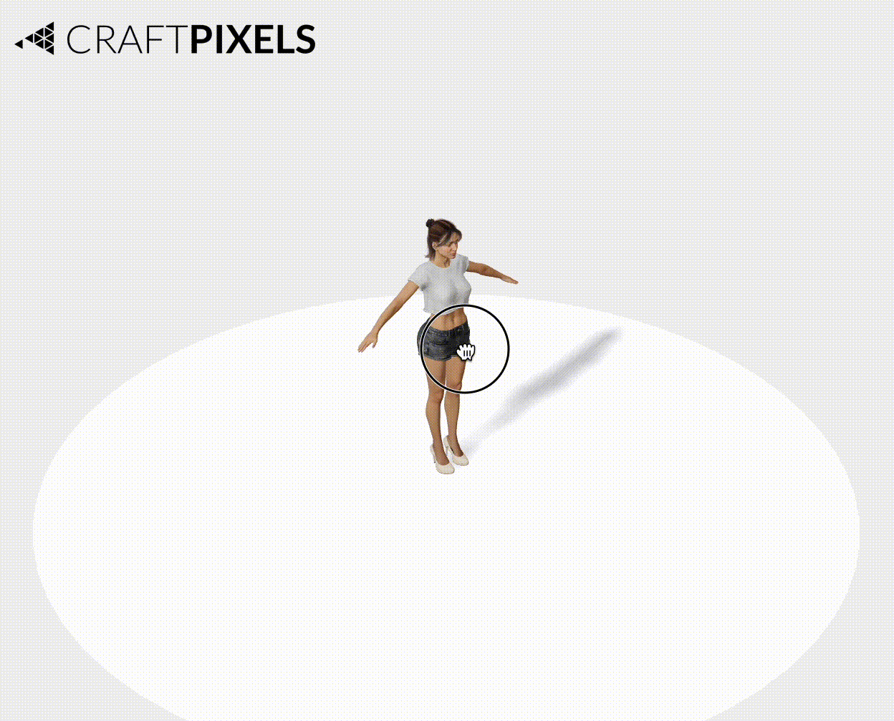

# R3F Object Controls

A lightweight custom rotation control component for [React Three Fiber](https://github.com/pmndrs/react-three-fiber).  
Supports smooth mouse and touch rotation with optional OrbitControls integration.

* ThreeJS orbit controls were designed to make the camera orbit around a target in your scene. This is ideal for exploring a scene from different angles while keeping a central point in focus. 
* In contrast, our R3F object controls allow you to rotate the target object itself within the scene. This is perfect when you want to directly manipulate and inspect a specific 3D model. 

---

## Features

- 🎯 Rotate only when clicking/tapping on the object
- 🌀 Smooth, damped rotation
- 🔒 Clamp X-axis rotation within a custom range
- 🔄 Works alongside OrbitControls (disables Orbit during drag)
- 🖱️ Mouse + 📱 Touch support
- ✅ Plug-and-play React component

---
## Screenshot
### Orbit Controls Demo

### Object Controls Demo


---

## Usage

```tsx
import { ObjectControls } from "r3f-object-controls";
import { Canvas } from "@react-three/fiber";
import { OrbitControls } from "@react-three/drei";
import { useRef } from "react";
import { Mesh } from "three";

export default function Scene() {
  const objectRef = useRef<Mesh>(null);
  const orbitRef = useRef<any>(null);

  return (
    <Canvas>
      <ambientLight />
      <OrbitControls ref={orbitRef} />
      <mesh ref={objectRef}>
        <boxGeometry />
        <meshStandardMaterial color="orange" />
      </mesh>

      <ObjectControls
        object={objectRef}
        orbitControl={orbitRef}
        dampingFactor={0.1}
        maxRotationX={Math.PI / 2}
        minRotationX={-Math.PI / 2}
        enableXRotation={true}
        enableYRotation={true}
      />
    </Canvas>
  );
}
```

## Props

| Prop              | Type                    | Default        | Description                                                   |
| ----------------- | ----------------------- | -------------- | ------------------------------------------------------------- |
| `object`          | `React.RefObject<Mesh>` | **Required**   | The mesh object to apply rotation controls to                 |
| `orbitControl`    | `React.RefObject<any>`  | `undefined`    | Reference to OrbitControls to auto-disable during interaction |
| `dampingFactor`   | `number`                | `0.1`          | How smoothly the rotation transitions (0 to 1)                |
| `maxRotationX`    | `number`                | `Math.PI / 2`  | Maximum X-axis rotation (in radians)                          |
| `minRotationX`    | `number`                | `-Math.PI / 2` | Minimum X-axis rotation (in radians)                          |
| `enableXRotation` | `boolean`               | `true`         | Enable rotation along the X-axis                              |
| `enableYRotation` | `boolean`               | `true`         | Enable rotation along the Y-axis                              |


## How It Works

* Uses Raycaster to detect if the pointer is on the mesh.
* On drag (mouse or touch), calculates delta movement.
* Applies smoothed rotation to the object using MathUtils.lerp.
* While interacting, OrbitControls (if present) are disabled.

## Example

```tsx
<ObjectControls
  object={meshRef}
  orbitControl={orbitRef}
  dampingFactor={0.15}
  maxRotationX={Math.PI / 3}
  minRotationX={-Math.PI / 3}
  enableXRotation={true}
  enableYRotation={false}
/>
```

## Mobile Support

Fully touch-optimized:

* One-finger drag rotates the object.
* Prevents page scroll while touching the object.

## License

MIT © [Craftpixels]
